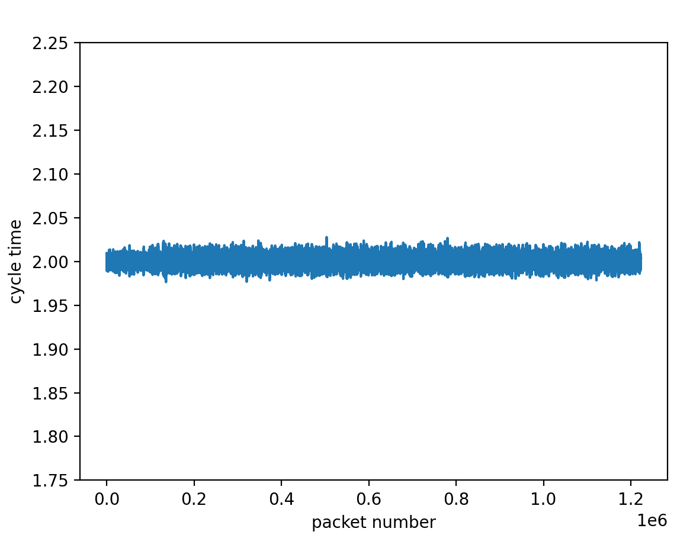
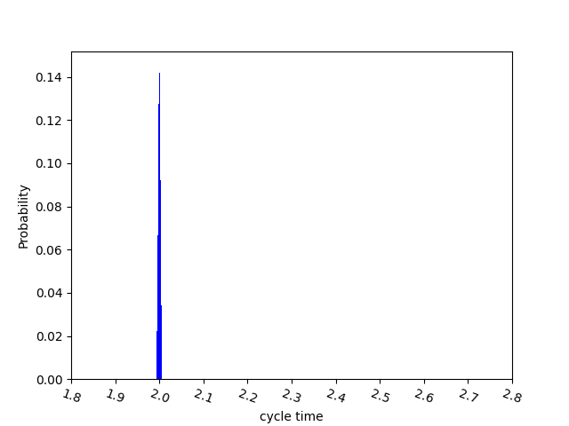

# statistics


```
python3 scatter_2ms.py    test2.csv
python3 max_min_2ms.py    test2.csv
```

# 折线图

不设置x坐标的尺度，***要求样本> 1百万***，自己会对齐刻度（1百万）  

```
polyline_2ms_max7.py opt13.csv 
python3 polyline_2ms.py opt13.csv 
```

polyline_2ms.py的y轴在(1.75, 2.25)  
polyline_2ms_max7.py的y轴在ylim(min_t, max_t)  

***推荐用polyline_2ms.py，polyline_2ms.py最大样本是1300000***  



# 直方图

```
python3  hist2ms_max7.py  opt13.csv 
```
hist2ms_max7.py 的横坐标在bins= [1.8, 2.8]之间



# 过滤

filter.py

过滤数据 并生成csv